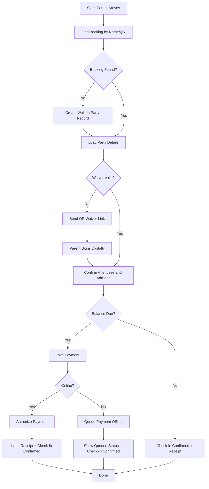
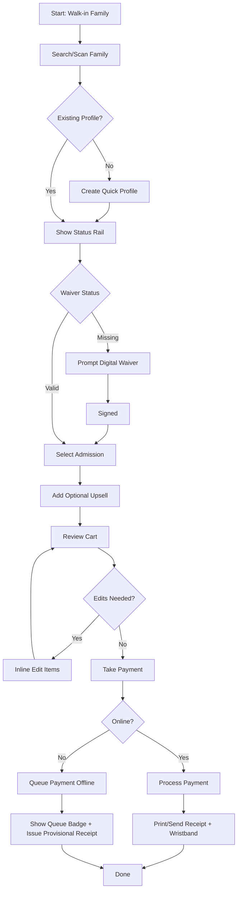
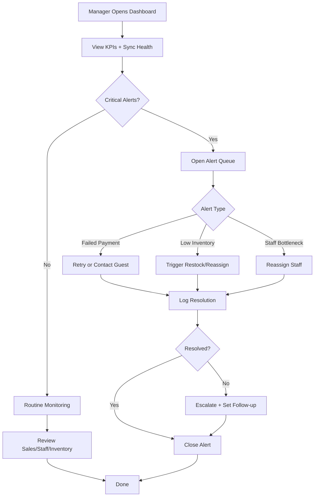

# UX Design Specification

This document will capture the collaborative UX design process for POSOpen, following the BMad micro-file workflow. All steps will be completed in sequence, with user input guiding each phase.

---

## Step 2: Project Understanding

**Project Name:** POSOpen

**Key Insights from Documentation:**
- POSOpen is a next-generation POS for kids activity centers, designed for operational speed, offline-first reliability, and a unified experience across party, retail, admissions, and catering.
- The system is optimized for mobile/tablet/Windows, with a focus on rapid transactions, role-based UI, and seamless staff and customer experiences.
- Unique features include: 5-min sync, robust local failover, gamified staff incentives, dynamic pricing, digital waivers, neurodiversity support, and modular extensibility.

**Target Users:**
- Front-desk staff (admissions, check-in, party management)
- Managers (reporting, scheduling, inventory)
- Guests/parents (booking, check-in, payment, digital waivers)
- Back-office staff (operations, reconciliation)
- The system is designed for both tech-savvy and non-technical users, with accessibility and neurodiversity support.

---

## Step 3: Core Experience Definition

**Core Experience:**
- The most frequent and critical user action is checking in guests and parties quickly and accurately.
- The admissions and check-in flow must be fast, intuitive, and reliable—even offline—to ensure staff and guest satisfaction.

---

## Step 4: Desired Emotional Response

**Emotional Goals:**
- Users (staff and guests) should feel confident, empowered, and relieved—knowing the system is fast, reliable, and easy, even during busy or offline moments.
- The emotion that would drive word-of-mouth is delight: staff feel their job is easier and more fun, guests feel welcomed and cared for, and managers feel in control.

*Step 4: Emotional response defined. Ready for next step.*

---

## Step 5: UX Pattern Analysis & Inspiration

**Inspiration Apps & Lessons:**

1. Square POS
- Extremely fast checkout with minimal taps
- Clear visual hierarchy for busy frontline workflows
- Simple error recovery when mistakes happen mid-transaction

POSOpen patterns to borrow:
- Fast-lane check-in and admission actions
- Large, touch-friendly controls for peak throughput
- Inline undo/edit during active carts and party flows

2. Toast
- Handles complex order states without overwhelming staff
- Strong role-based workflows (server, manager, kitchen)
- Reliable operation during rush periods with resilient sync behavior

POSOpen patterns to borrow:
- State-driven UI for party timelines (booked, checked-in, in-progress, completed)
- Role-aware screens for front desk vs manager vs party host
- Queue-based offline actions with clear sync status indicators

3. Disney Parks App
- Combines high-emotion experiences with practical logistics
- Excellent wayfinding and "what's next" clarity
- Proactive notifications that build guest confidence

POSOpen patterns to borrow:
- Family-friendly, reassuring tone during booking/check-in/payment
- Next-best-action guidance for staff and parents
- Real-time alerts (party room ready, food ready, waiver needed)

**Recommended UX Pattern Stack:**
- Primary pattern: speed-first task completion
- Secondary pattern: guided orchestration for multi-step party flows
- Emotional layer: calm confidence plus delight during high-energy operations

*Step 5: Inspiration analysis saved. Ready for next step.*

---

## Step 6: Design System Choice

**Decision:** Themeable design system (recommended and selected)

**Rationale:**
- Supports tablet-first front-of-house and Windows back-office consistency
- Delivers strong accessibility and proven component behavior out of the box
- Enables speed of delivery without sacrificing branded, family-friendly expression
- Provides flexibility for role-based UX and domain-specific operational states

**Implementation Direction:**
- Use a token-driven foundation (color, spacing, typography, motion, semantic state)
- Build a thin POSOpen component layer for domain components:
	- Fast check-in cards
	- Sync/offline status banners
	- Queue and fulfillment chips
	- Party timeline state components

*Step 6: Design system choice saved. Ready for next step.*

---

## Step 7: Defining Core Experience

**Defining Experience:**
- Run a complete guest moment in under 20 seconds.
- In one guided flow, staff can check in a family or party, validate waiver status, add admissions or items, take payment, and complete with clear confirmation.
- The interaction should feel like a fast lane, not a maze of screens.

**Why This Core Matters:**
- It targets the highest-frequency, highest-stress frontline task.
- If this interaction is excellent, the overall product experience feels excellent.
- It delivers the product promise of speed, confidence, and reliability even while offline.

**User Mental Model:**
- Staff think in terms of "people at the desk right now," not abstract records.
- They expect to search or scan, see status instantly, and finish in a few taps.
- Current friction is caused by context switching, missing waiver/payment status, and unclear next actions.

**Core Experience Success Criteria:**
1. Typical repeat-family check-in completes in under 20 seconds.
2. Staff always sees the next best action without hunting.
3. Completion provides explicit done confirmation plus offline queue status.
4. Errors can be corrected inline without restarting.
5. Interaction logic remains consistent across tablet and desktop.

**Pattern Strategy:**
- Use established patterns combined in a domain-specific flow.
- Adopt quick search/scan, status badges, sticky action bars, and progressive disclosure.
- Combine admissions, party, waiver, and payment into one guided lane.

*Step 7: Defining core experience saved. Ready for next step.*

---

## Step 8: Visual Design Foundation

### Color System
- Strategy: calm operational trust with energetic family-friendly accents.
- Primary: Deep Teal (#0F766E)
- Secondary: Sky Blue (#0EA5E9)
- Accent/Action: Warm Orange (#F97316)
- Success: Green (#16A34A)
- Warning: Amber (#D97706)
- Error: Red (#DC2626)
- Info: Blue (#2563EB)
- Neutrals:
	- #0F172A (900) primary text
	- #334155 (700) secondary text
	- #64748B (500) tertiary text
	- #CBD5E1 (300) borders
	- #F1F5F9 (100) surfaces
	- #F8FAFC (50) app background

Semantic usage:
- Primary actions: teal
- High-priority alerts and required tasks: orange
- Status badges: green, amber, red, blue
- Offline and sync states:
	- Queued/offline: amber
	- Synced: green
	- Error/retry: red

Accessibility targets:
- Minimum WCAG AA contrast for all text and content states
- Large text and critical controls designed for AAA where practical

### Typography System
- Primary font: Atkinson Hyperlegible
- Secondary/display font: Manrope
- Hierarchy:
	- H1: 32/40 semibold
	- H2: 24/32 semibold
	- H3: 20/28 semibold
	- Body L: 18/28 regular
	- Body M: 16/24 regular
	- Body S: 14/20 regular
	- Label: 13/16 medium
	- Button text: 16/20 medium
	- Numeric emphasis: tabular numerals, semibold

### Spacing and Layout
- Base spacing unit: 8px
- Spacing scale: 4, 8, 12, 16, 24, 32, 48
- Layout density: efficient but breathable for high-throughput desk use
- Grid:
	- Desktop/back-office: 12 columns
	- Tablet/front-of-house: 6 columns (or 4 for narrow portrait)
	- Mobile assistant views: 4 columns
- Touch targets:
	- Minimum 44x44px
	- Preferred 48x48px for primary actions
- Sticky action zones for complete check-in and take payment

### Layout Principles
1. One-screen completion for the core guest moment whenever possible.
2. Status-at-a-glance before detail (waiver, payment, party state, sync state).
3. Progressive disclosure for advanced options to reduce cognitive load.
4. Role-aware information density (front desk simplified, manager expanded).

### Motion and Feedback
- Micro-motion is functional, not decorative.
- Instant feedback on taps, scans, saves, queueing, and sync.
- Distinct offline and sync transitions to preserve trust and reduce ambiguity.

*Step 8: Visual foundation saved. Ready for next step.*

---

## Step 9: Design Direction Decision

### Design Directions Explored
- Six visual directions were explored in the interactive showcase at [ _bmad-output/planning-artifacts/ux-design-directions.html ](_bmad-output/planning-artifacts/ux-design-directions.html):
	1. Fast Lane Classic
	2. Data-Forward Ops
	3. Family Warmth
	4. Ultra-Minimal Speed
	5. Playful Premium
	6. Guided Mission Control

### Chosen Direction
- Direction 6: Guided Mission Control (recommended baseline)

### Design Rationale
- Best alignment with POSOpen's core promise of speed, clarity, and resilience.
- Supports the 20-second guest moment with next-best-action guidance.
- Provides confidence through clear waiver/payment/sync signals.
- Enables inline recovery without forcing users to restart workflows.
- Balances operational efficiency with family-friendly clarity.

### Implementation Approach
- Use Direction 6 as the core interaction and layout model.
- Optionally blend selective warmth cues from Direction 3 in guest-facing moments.
- Keep density and clarity optimized for tablet front-of-house operation.
- Preserve role-aware variants for managers and back-office users.

*Step 9: Design direction decision saved. Ready for next step.*

---

## Step 10: User Journey Flows

### Parent Party Booking and Check-In

Entry and core flow:
- Parent books online or confirms existing booking at venue.
- Staff identifies booking, verifies waiver status, confirms attendees and add-ons, collects balance, and completes check-in.

Recovery and resilience:
- Missing waiver triggers QR-based digital signing and then returns to flow without restart.
- Offline payment is queued with explicit sync/retry status.

### Front-Desk Rapid Admission and Checkout

Entry and core flow:
- Walk-in family arrives for admissions.
- Staff searches/scans, validates waiver, selects admission package, optionally upsells, collects payment, and issues receipt/wristband.

Optimization and recovery:
- One-screen fast-lane interaction with next-best-action guidance.
- Inline cart edits prevent restart loops.

### Manager Operations Review and Intervention

Entry and core flow:
- Manager opens shift dashboard and reviews KPIs, sync health, and alert queue.
- Manager handles blockers (failed payments, inventory shortages, staffing bottlenecks), confirms resolution, and closes alerts.

Escalation path:
- Unresolved issues are escalated with follow-up tracking.

### Journey Patterns
- Entry by search/scan/QR to minimize friction.
- Status-at-a-glance before detailed actions.
- Inline recovery over restart.
- Explicit completion feedback with sync/payment state.
- Role-aware information density and controls.

### Flow Optimization Principles
1. Minimize taps to value on frontline tasks.
2. Keep decisions contextual and local.
3. Maintain visible system state at all times.
4. Preserve trust with explicit offline/queued handling.
5. Standardize feedback and completion patterns.

*Step 10: User journey flows saved. Ready for next step.*

---

## Step 11: Component Strategy

### Design System Components
Use standard components from the themeable system for:
- Buttons, inputs, selects, toggles, tabs, modals, drawers
- Tables and lists, cards, badges/chips, toasts, alerts
- Form validation patterns, loading/skeleton states
- Navigation primitives (top bar, side nav, stepper)
- Accessibility primitives (focus states, keyboard interactions, ARIA scaffolding)

### Custom Components

#### Guest Moment Fast Lane Panel
**Purpose:** Complete admissions/check-in/payment in a single guided lane.
**Usage:** Frontline desk during live guest interactions.
**States:** Idle, active, blocked (waiver), payment pending, queued offline, completed.
**Accessibility:** Keyboard tab order and live-region updates for status changes.

#### Confidence Strip
**Purpose:** Always-visible waiver/payment/sync certainty indicators.
**Usage:** Top of active transaction context.
**States:** Valid, warning, blocked, queued, error, synced.
**Variants:** Compact (tablet), expanded (desktop).

#### Party Timeline Rail
**Purpose:** Visualize party lifecycle and required next actions.
**Usage:** Party check-in and in-progress operations.
**States:** Booked, arrived, waiver pending, active, completed, exception.
**Interactions:** Jump-to-step, inline fix, action prompts.

#### Offline Queue Badge + Drawer
**Purpose:** Make queued actions transparent and recoverable.
**Usage:** All payment and save operations during connectivity disruption.
**States:** Queue healthy, retrying, failed, resolved.
**Interactions:** Manual retry, bulk retry, detail trace.

#### Next Best Action Card
**Purpose:** Recommend immediate high-value action per user context.
**Usage:** Staff dashboard and active guest records.
**States:** Normal, urgent, blocked, dismissed.
**Variants:** Staff, manager.

#### Inline Recovery Composer
**Purpose:** Resolve errors without restarting journey.
**Usage:** Invalid waiver/payment/selection conflicts.
**States:** Suggested fix, manual fix, unresolved escalation.

### Component Implementation Strategy
1. Build custom components on top of design-system tokens and primitives.
2. Standardize interaction contracts for status semantics, loading/error behavior, and completion feedback.
3. Enforce accessibility by default with keyboard-first interaction and ARIA labeling.
4. Maintain cross-platform parity with shared interaction logic and layout/density variants.

### Implementation Roadmap
1. Phase 1 (Core Flow Critical):
	- Guest Moment Fast Lane Panel
	- Confidence Strip
	- Offline Queue Badge + Drawer
2. Phase 2 (Operational Clarity):
	- Party Timeline Rail
	- Next Best Action Card
3. Phase 3 (Resilience and Optimization):
	- Inline Recovery Composer
	- Manager-specific variants and analytics overlays

*Step 11: Component strategy saved. Ready for next step.*

---

## Step 12: UX Consistency Patterns

### Button Hierarchy
- Primary buttons:
	- Use for one dominant task per screen (for example: Complete Check-In, Take Payment).
	- Style: solid primary color, high contrast, larger touch target (minimum 48x48 preferred).
- Secondary buttons:
	- Use for supporting actions (Edit, Add Item, View Details).
	- Style: outlined/neutral.
- Tertiary/text buttons:
	- Use for low-risk utility actions (Cancel, Dismiss, Learn More).
- Destructive actions:
	- Use explicit destructive style and confirmation for irreversible operations.
- Placement rule:
	- Primary action anchored in sticky action zone on tablet and fixed footer on mobile.
- Keyboard rule:
	- Enter triggers primary action only when form is valid and focus context is clear.

### Feedback Patterns
- Success:
	- Immediate inline confirmation plus optional toast.
	- For transaction completion, show explicit done state with receipt/sync status.
- Warning:
	- Use amber warning for recoverable issues (waiver missing, network unstable).
	- Provide next-best-action directly in message.
- Error:
	- Use red error with clear reason, recovery action, and no dead-ends.
	- Keep user in context and offer inline correction.
- Info:
	- Blue informational banners for non-blocking status updates.
- Offline/sync feedback:
	- Always-visible queue/sync indicator.
	- Distinguish queued, retrying, failed, synced states with text plus icon/color.

### Form Patterns
- Validation:
	- Validate early for high-risk fields and on blur for standard fields.
	- Never clear user-entered data on validation failure.
- Required fields:
	- Mark clearly and provide concise helper text before errors occur.
- Error messaging:
	- Specific, human-readable, and action-oriented.
- Inline recovery:
	- Keep correction in place and avoid forced restart of forms/flows.
- Input optimization:
	- Use masks/autofill for phone/date/payment where relevant.
	- Offer scan/search shortcuts when available.
- Accessibility:
	- Labels always visible, errors linked via ARIA-describedby, logical tab order.

### Navigation Patterns
- Frontline tablet:
	- Task-centered navigation with fast switching between Queue, Active Guest, and Checkout.
- Manager desktop:
	- Information-centered navigation with dashboard, alerts, reporting, inventory, staffing.
- Navigation clarity:
	- Always show current location and active context (guest/party/session).
- Back behavior:
	- Never lose transaction state when navigating away and back.
- Next Best Action:
	- Persistent contextual guidance panel for high-frequency tasks.

### Additional Patterns
- Modal and overlay:
	- Use modals for focused, short decisions.
	- Use drawers/side panels for contextual detail while preserving task continuity.
	- Never use modal chains for critical flows; prefer inline progressive disclosure.
	- Confirmation dialogs only for destructive/irreversible actions.
- Empty and loading states:
	- Empty states explain why and offer immediate next action.
	- Skeletons for list/card loading; spinner only for short blocking operations.
- Search and filtering:
	- Search-first pattern for guest/booking retrieval with scan fallback.
	- Quick filters as chips (Today, Waiver Pending, Payment Due, Offline Queue).
	- Show result count and applied filters with one-tap reset.

### Design System Integration Rules
1. Build all patterns with design-system primitives and shared tokens.
2. Keep semantic status mapping consistent across screens/components.
3. Reuse feedback language patterns for predictability.
4. Enforce mobile-first touch targets and keyboard accessibility parity.

*Step 12: UX consistency patterns saved. Ready for next step.*

---

## Step 13: Responsive Design & Accessibility

### Responsive Strategy
- Desktop (1024px+):
	- Multi-panel operational views for manager and back-office roles.
	- Higher information density with persistent side navigation and contextual detail panes.
- Tablet (768px-1023px):
	- Primary frontline target.
	- Touch-first layouts with sticky action zones and simplified panel structure.
	- Focus on one active guest moment plus status strip and quick actions.
- Mobile (320px-767px):
	- Companion/support views (light operations, status checks, alerts, approvals).
	- Bottom navigation, single-column flows, and strict prioritization of critical actions.

### Breakpoint Strategy
- Mobile: 320px-767px
- Tablet: 768px-1023px
- Desktop: 1024px+
- Approach: mobile-first CSS with role-specific density enhancements at tablet/desktop breakpoints.
- Additional behavior breakpoint at 1280px+ for advanced manager dashboards.

### Accessibility Strategy
- Target compliance: WCAG 2.2 AA as baseline.
- Critical-flow aspiration: AAA contrast/readability where practical.
- Core requirements:
	- Minimum contrast ratio 4.5:1 for normal text.
	- Touch targets minimum 44x44px; preferred 48x48px for primary actions.
	- Full keyboard navigation parity for critical interactions.
	- Screen reader compatibility with semantic structure and ARIA labels.
	- Visible focus indicators and skip links.
	- Status communication cannot rely on color alone (icon + text required).

### Testing Strategy
- Responsive testing:
	- Real-device tests on frontline tablets and manager desktops.
	- Browser coverage: Chrome, Edge, Safari, Firefox.
	- Orientation testing on tablets (landscape and portrait).
- Accessibility testing:
	- Automated audits (axe or equivalent) in CI and pre-release.
	- Manual keyboard-only walkthroughs for critical journeys.
	- Screen reader verification (NVDA, VoiceOver; JAWS as needed).
	- Color blindness and high-contrast simulation testing.
- User validation:
	- Include users with accessibility needs in pilot tests.
	- Validate under peak-time operational conditions.

### Implementation Guidelines
- Responsive development:
	- Use relative units (rem/%), fluid containers, and mobile-first media queries.
	- Keep one interaction model across form factors; change density/layout, not behavior.
	- Prioritize performance budgets for tablet frontline views.
- Accessibility development:
	- Use semantic HTML; apply ARIA only when needed.
	- Ensure deterministic focus order and managed focus after dialogs.
	- Use consistent error summary + inline error pattern.
	- Announce payment/sync/queue state changes with live regions.
- Inclusive UX behavior:
	- Provide low-stimulation options (reduced motion, calmer visuals).
	- Preserve user-entered data on validation or network errors.

*Step 13: Responsive design and accessibility strategy saved. Ready for final step.*

---

## Step 14: Workflow Completion

### Completion Summary
- UX design workflow is complete for POSOpen.
- The specification now includes project understanding, core experience, emotional goals, visual foundation, design directions, journey flows, component strategy, UX consistency patterns, and responsive/accessibility strategy.
- This document is finalized for design and engineering handoff.

### Deliverables
- UX Design Specification: _bmad-output/planning-artifacts/ux-design-specification.md
- Design Directions Showcase: _bmad-output/planning-artifacts/ux-design-directions.html
- Color Themes Visualizer: _bmad-output/planning-artifacts/ux-color-themes.html

### Suggested Next Steps
1. Wireframe generation for key flows (fast lane check-in, admissions checkout, manager alert handling).
2. Interactive prototype for user validation with frontline staff.
3. Solution architecture alignment using UX interaction contracts.
4. Epic and story creation mapped to journey and component priorities.

### Recommended Sequence
- UX Wireframes -> Interactive Prototype -> Technical Architecture -> Epics/Stories -> Implementation

*Step 14: UX workflow complete.*
